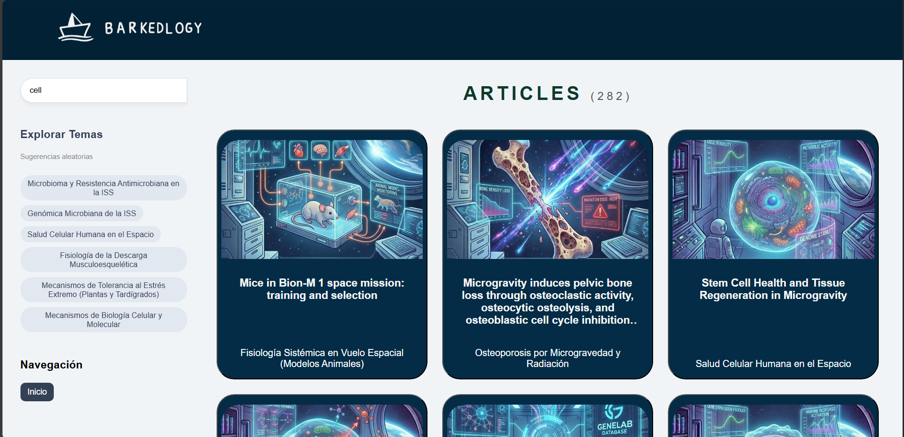
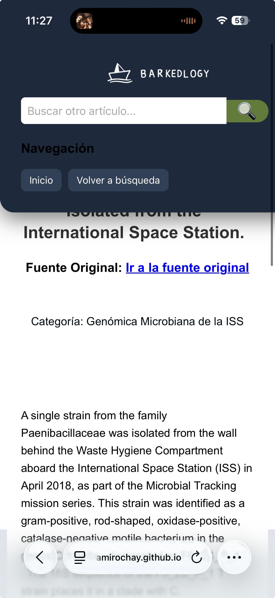

🚀 BARKEDLOGY: Space Biology Knowledge Engine 

Barkedlogy es una plataforma web interactiva y un motor de conocimiento diseñado para democratizar el acceso a la investigación científica sobre biología espacial de la NASA.

A diferencia de un buscador tradicional que solo busca palabras clave, Barkedlogy utiliza algoritmos de Machine Learning (Reglas de Asociación) para "entender" el contexto, sugiriendo términos relacionados científicamente (por ejemplo, relacionando "Microgravedad" con "Pérdida Ósea" aunque el usuario no lo escriba explícitamente).

📋 Tabla de Contenidos

Descripción General y Propósito

Características Principales

Ciencia de Datos y Lógica del Motor

Arquitectura del Sistema

Detalles de Implementación Frontend

Estructura del Proyecto

Instalación y Uso Local

Despliegue (Deployment)

API Endpoints

Tecnologías Utilizadas

🌍 Descripción General y Propósito

El volumen de publicaciones científicas de la NASA es inmenso y a menudo difícil de navegar para estudiantes o investigadores externos. El objetivo de este proyecto fue crear una interfaz amigable que no solo liste documentos, sino que guíe al usuario a través de temas conectados.

El sistema procesa un dataset de publicaciones de biología espacial, las agrupa en categorías lógicas (Clusters) y descubre relaciones ocultas entre conceptos científicos para mejorar la experiencia de búsqueda.

✨ Características Principales

🔍 Buscador Semántico Inteligente

Autocompletado Contextual: Al escribir, el sistema no solo sugiere frases que completan la palabra, sino conceptos científicos relacionados basados en el cálculo de Lift y Confianza de las reglas de asociación.

Expansión de Consulta: Si un usuario busca un término, el backend busca automáticamente sinónimos y términos fuertemente asociados en la base de datos.

🌌 Exploración Visual por Clusters

Categorización Automática: Los artículos están organizados en 19 clusters temáticos definidos por algoritmos de NLP (Procesamiento de Lenguaje Natural).

Identidad Visual: Cada categoría (ej. "Radiación", "Expresión Génica") posee una identidad visual única con imágenes generadas que facilitan la identificación rápida.

📱 Diseño Responsivo (Mobile-First)

Adaptabilidad Total: La interfaz se transforma fluidamente desde pantallas de escritorio grandes hasta dispositivos móviles pequeños.

Menú Tipo "Persiana": En móviles, la navegación lateral se convierte en un menú superior desplegable para maximizar el espacio de lectura.

Tipografía Legible: Ajuste dinámico de tamaños de fuente y márgenes para evitar la fatiga visual en pantallas pequeñas.

⚡ Experiencia de Usuario (UX) Optimizada

Carga Progresiva (Lazy Loading): Implementación de paginación dinámica ("Cargar más") para manejar miles de artículos sin congelar el navegador.

Persistencia de Estado: Uso de localStorage para recordar la búsqueda y la posición del usuario al navegar entre el listado y los detalles del artículo.

🧠 Ciencia de Datos y Lógica del Motor

El "cerebro" del proyecto reside en cómo se procesaron los datos antes de llegar a la web:

Limpieza de Datos: Procesamiento de final_dataset.csv para normalizar resúmenes (abstracts) y títulos.

Clustering (Agrupamiento): Se utilizaron algoritmos no supervisados para agrupar los artículos en 19 temas principales (Clusters), asignando a cada uno un ID y un nombre descriptivo (ej. Cluster 105: "Mecanismos de Biología Celular").

Reglas de Asociación (Apriori):

Se generaron reglas del tipo: Si aparece "Estrés Oxidativo", entonces es probable que aparezca "Mitocondria".

Estas reglas se almacenan en apriori_rules.json y son consumidas por la API para potenciar las sugerencias de búsqueda.

🏗 Arquitectura del Sistema

El proyecto sigue una arquitectura Cliente-Servidor desacoplada, lo que permite escalar cada parte de forma independiente.

1. Backend (API REST)

Tecnología: Python + FastAPI.

Responsabilidad: Cargar los modelos de ML en memoria, filtrar el dataset de pandas en tiempo real y servir las respuestas en formato JSON.

Despliegue: La API se desplegó y está corriendo en la nube a través de Render.

2. Frontend (SPA - Single Page Application feel)

Tecnología: HTML5, CSS3, JavaScript (Vanilla).

Filosofía: "Sin Frameworks". Se optó por JavaScript puro para garantizar el máximo rendimiento y control total sobre el DOM.

Despliegue: La página web se levantó y está hospedada estáticamente en GitHub Pages.

🎨 Detalles de Implementación Frontend

Animación de Olas: Se implementó una animación CSS pura con SVG y keyframes para crear un efecto de "océano de conocimiento" en el encabezado, optimizada para no consumir CPU en móviles.

Sistema de Grid Dinámico: Las tarjetas de artículos utilizan display: grid con minmax para auto-organizarse según el ancho de la pantalla disponible.

Manejo de Errores en Imágenes: Script de fallback que detecta si una imagen de cluster no existe y la reemplaza automáticamente por un placeholder para no romper la estética.

📂 Estructura del Proyecto

/proyecto-raiz
│
├── /assets                 # Recursos estáticos
│   ├── /clusters           # Imágenes específicas por ID de cluster (100.jpg...)
│   ├── logo_barquito.png   # Logotipo principal
│   └── ...
│
├── index.html              # Landing Page con buscador principal
├── search_page.html        # Interfaz de resultados con filtros y grid
├── article.html            # Vista de lectura inmersiva del artículo
│
├── styles.css              # Hoja de estilos maestra (Variables, Layout, Responsive)
├── script.js               # Controlador lógico (Fetch API, Renderizado DOM, Eventos)
│
└── /backend                # Lógica del Servidor
    ├── /src
    │   ├── api.py          # Punto de entrada de FastAPI
    │   ├── requirements.txt # Lista de dependencias (pandas, scikit-learn...)
    │   ├── models/         # Archivos JSON con reglas de asociación y clusters
    │   └── data/           # Datasets CSV procesados

💻 Instalación y Uso Local

Prerrequisitos

Python 3.9 o superior.

Git instalado.

1. Clonar el repositorio

git clone [https://github.com/ramirochay/barkedlogy.git]
cd barkedlogy

2. Configurar el Backend (Python)

Navega a la carpeta del código fuente del backend:

cd backend/src

# (Recomendado) Crear entorno virtual
python -m venv venv
# Activar: source venv/bin/activate (Mac/Linux) o venv\Scripts\activate (Windows)

# Instalar librerías necesarias
pip install -r requirements.txt

# Iniciar el servidor localmente
uvicorn api:app --reload

El servidor estará escuchando en http://127.0.0.1:8000

3. Configurar el Frontend

Abre el archivo script.js en la raíz del proyecto.

Busca la constante API_URL en las primeras líneas.

Cambia la URL de producción por la local:

const API_URL = "[http://127.0.0.1:8000](http://127.0.0.1:8000)";

Abre index.html en tu navegador web.

.

🚀 Despliegue (Deployment)

El proyecto está configurado para un despliegue continuo (CI/CD) utilizando servicios en la nube gratuitos para garantizar la accesibilidad pública.

Backend (API): Se desplegó utilizando Render como plataforma PaaS.

El servicio detecta automáticamente los cambios en la rama principal (main) y reconstruye el entorno Python instalando las dependencias desde requirements.txt.

Configuración: Se forzó el uso de PYTHON_VERSION = 3.9.18 para asegurar compatibilidad total con librerías científicas como Pandas y Scikit-learn.

Frontend (Web): La página se levantó utilizando GitHub Pages, lo que permite acceder a la aplicación desde cualquier dispositivo sin necesidad de instalación.

URL Pública: https://ramirochay.github.io/Barkedlogy_Searcher/index.html

Se conecta de forma segura (HTTPS) a la API alojada en Render para obtener los datos en tiempo real.

📡 API Endpoints Principales

Método

Endpoint

Descripción

GET

/clusters

Devuelve la lista de las 19 categorías temáticas y su conteo de artículos.

GET

/articles

Endpoint principal de búsqueda. Soporta filtros por texto, ID de cluster y paginación (skip/limit).

GET

/associations

Devuelve reglas de asociación (sugerencias) basadas en un término de entrada y un umbral de confianza.

🛠 Tecnologías Utilizadas

Lenguajes: Python 3.9, JavaScript (ES6+), HTML5, CSS3.

Frameworks Backend: FastAPI.

Servidor: Uvicorn.

Data Science: Pandas, Scikit-learn, Mlxtend.

Control de Versiones: Git & GitHub.

Infraestructura: Render (Backend) y GitHub Pages (Frontend).